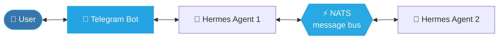
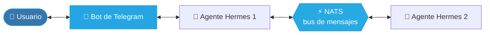

 

  

🇬🇧 English · <a href="#-en-español">🇪🇸 Léelo en español</a>

 

> [!TIP]
> **Open to junior developer roles, internships and collaborative projects.**
> The fastest way to reach me is [email](mailto:pablorgz98@gmail.com) or [LinkedIn](https://www.linkedin.com/in/pablors98).

 

## 👋 About me

I'm a junior developer who prefers building over reading about building. Lately my work has
converged on one thing: **automating my own workflows with Python** — assistant agents that talk
to each other over a message bus, bots that report to me on Telegram, and dashboards that pull
everything into one place.

It also means owning the unglamorous parts: the data model, the deployment, the configuration,
and making it all survive a reboot on a machine that isn't mine.

 

## 🧠 How my agents talk to each other

The pattern behind my current work — two agents exchanging messages over a **NATS** bus, with
**Telegram** as the human-facing interface:

 

## 🚀 Projects

<table>
<tr>
<td width="50%" valign="top">

### ⚡ [Arquitectura Doble Agente](https://github.com/PabloRS98/arquitectura-doble-agente)

A reference architecture for two Hermes agents that talk to each other over **NATS**, with
Telegram as the human-facing interface. Documents the messaging patterns and the wiring, so the
whole setup can be reproduced from scratch.

</td>
<td width="50%" valign="top">

### 📊 [Projects Dashboard](https://github.com/PabloRS98/projects-dashboard)

A multi-forge project manager that aggregates repositories from **GitHub, GitLab and Bitbucket**,
scans local clones for uncommitted or unpushed work, and pushes alerts to Telegram.

</td>
</tr>
<tr>
<td width="50%" valign="top">

### 📚 [Content-Media-Manager](https://github.com/PabloRS98/Content-Media-Manager)

A self-hosted catalog for books, movies, series, games and podcasts. Everything lives on your own
machine: **no cloud, no paid APIs, one Docker container**. Because tracking a personal library
shouldn't require a subscription.

</td>
<td width="50%" valign="top">

### 💰 [Finance Tracker](https://github.com/PabloRS98/finance-tracker)

A personal finance manager built with **Flask** — tracking income, expenses and balances through
a web interface.

</td>
</tr>
</table>

<b>🎮 ProyectoGRPG</b> — cross-platform RPG built with Flutter (private)

 

My largest codebase so far, and where most of my Dart and application-architecture learning has
happened. Still private while in development — happy to walk through the code or the architecture
on request.

 

## 🛠️ Tech Stack

<table>
<tr>
<td valign="top"><b>Languages</b></td>
<td>

</td>
</tr>
<tr>
<td valign="top"><b>Frameworks</b></td>
<td>

</td>
</tr>
<tr>
<td valign="top"><b>Infra &amp; Messaging</b></td>
<td>

</td>
</tr>
</table>

 

## 📫 Get in touch

I'm actively looking for my first professional opportunity as a developer. If you think I could be
a fit for your team — or you just want to talk about a project — I'd be glad to hear from you.

 

---

<h2 id="-en-español">🇪🇸 En español</h2>

<b>Haz clic para desplegar la versión en español</b>

 

**💼 Abierto a puestos junior, prácticas y proyectos en colaboración.** La vía más rápida para contactarme es [email](mailto:pablorgz98@gmail.com) o [LinkedIn](https://www.linkedin.com/in/pablors98).

### 👋 Sobre mí

Soy un desarrollador junior al que le sirve más construir que leer sobre cómo construir.
Últimamente mi trabajo ha convergido en una sola cosa: **automatizar mis propios flujos con
Python** — agentes asistentes que se comunican entre sí por un bus de mensajes, bots que me
reportan por Telegram y paneles que lo reúnen todo en un mismo sitio.

También significa encargarme de las partes que no lucen: el modelo de datos, el despliegue, la
configuración y conseguir que todo sobreviva a un reinicio en una máquina que no es la mía.

### 🧠 Cómo se comunican mis agentes

El patrón detrás de mi trabajo actual: dos agentes intercambiando mensajes por un bus **NATS**,
con **Telegram** como interfaz para el usuario.

### 🚀 Proyectos

**⚡ [Arquitectura Doble Agente](https://github.com/PabloRS98/arquitectura-doble-agente)** — `Python` · `NATS` · `Telegram`

Una arquitectura de referencia para dos agentes Hermes que se comunican por **NATS**, con Telegram
como interfaz para el usuario. Documenta los patrones de mensajería y el cableado necesario para
reproducir el montaje desde cero.

**📊 [Projects Dashboard](https://github.com/PabloRS98/projects-dashboard)** — `Python` · `APIs REST` · `Telegram`

Un gestor de proyectos multi-forge que agrega repositorios de **GitHub, GitLab y Bitbucket**,
escanea los clones locales en busca de trabajo sin commitear o sin subir, y envía alertas por
Telegram.

**📚 [Content-Media-Manager](https://github.com/PabloRS98/Content-Media-Manager)** — `Python` · `Docker` · `MIT`

Un catálogo self-hosted para libros, películas, series, videojuegos y podcasts. Todo vive en tu
propia máquina: **sin nube, sin APIs de pago, un solo contenedor Docker**. Porque llevar el
registro de una biblioteca personal no debería exigir una suscripción.

**💰 [Finance Tracker](https://github.com/PabloRS98/finance-tracker)** — `Python` · `Flask`

Un gestor de finanzas personales hecho con **Flask**: seguimiento de ingresos, gastos y saldos a
través de una interfaz web.

**🎮 ProyectoGRPG** — `Dart` · `Flutter` · *privado*

Un proyecto de RPG multiplataforma hecho con Flutter. Es mi base de código más grande hasta la
fecha y donde he aprendido la mayor parte de lo que sé de Dart y de arquitectura de aplicaciones.
Sigue en privado mientras está en desarrollo — encantado de enseñar el código o explicar la
arquitectura si hay interés.

### 🛠️ Stack tecnológico

| | |
|:--|:--|
| **Lenguajes** | Python · Dart |
| **Frameworks** | Flask · Flutter |
| **Infraestructura y mensajería** | Docker · NATS · Telegram Bot API · SQLite · Linux · Git |

### 📫 Contacto

Estoy buscando activamente mi primera oportunidad profesional como desarrollador. Si crees que
puedo encajar en tu equipo — o simplemente quieres hablar de algún proyecto — escríbeme.

| | |
|---|---|
| 📧 **Email** | [pablorgz98@gmail.com](mailto:pablorgz98@gmail.com) |
| 💼 **LinkedIn** | [linkedin.com/in/pablors98](https://www.linkedin.com/in/pablors98) |

<a href="#"><b>⬆️ Volver arriba</b></a>

