<!-- Generated by scripts/build_assets.py — edit the script, not this file. -->


 

 

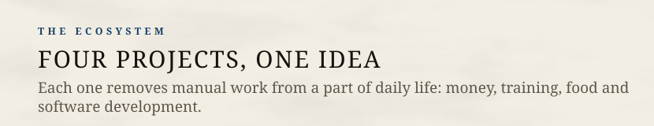

<a href="https://github.com/PabloRS98/finance-tracker">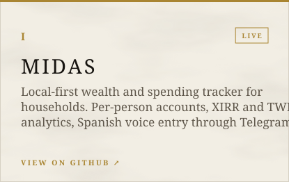</a>
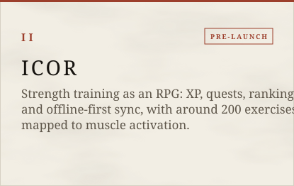
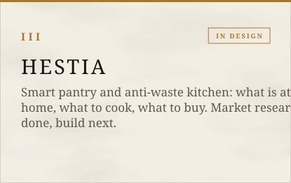
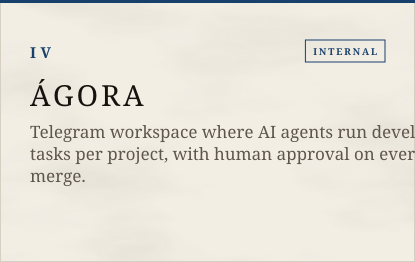

 

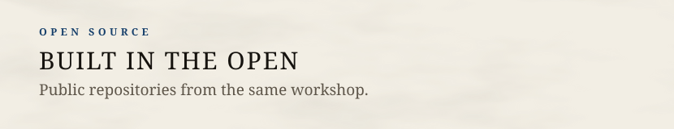
<a href="https://github.com/PabloRS98/projects-dashboard">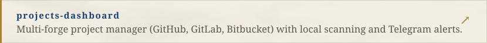</a>
<a href="https://github.com/PabloRS98/Content-Media-Manager">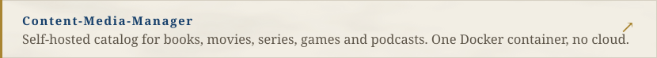</a>
<a href="https://github.com/PabloRS98/arquitectura-doble-agente">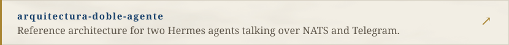</a>

🇬🇧 English · <a href="#-en-español">🇪🇸 Léelo en español</a>

 

> [!TIP]
> **Open to junior developer roles, internships and collaborative projects.** Fastest way to reach me: [email](mailto:pablorgz98@gmail.com) or [LinkedIn](https://www.linkedin.com/in/pablors98).

<b>🧠 How my agents talk to each other</b>

 

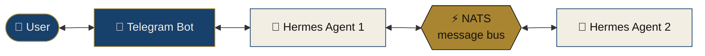
```mermaid
flowchart LR
    U(["👤 User"]) <--> TG["📱 Telegram Bot"]
    TG <--> H1["🤖 Hermes Agent 1"]
    H1 <--> N{{"⚡ NATS<br>message bus"}}
    N <--> H2["🤖 Hermes Agent 2"]

    style U fill:#17406b,stroke:#a98532,color:#f2eee4
    style TG fill:#17406b,stroke:#a98532,color:#f2eee4
    style H1 fill:#f2eee4,stroke:#17406b,color:#16130f
    style H2 fill:#f2eee4,stroke:#17406b,color:#16130f
    style N fill:#a98532,stroke:#16130f,color:#16130f
```

<b>📈 Activity</b> (auto-updated)

 

<picture>
  <source media="(prefers-color-scheme: dark)" srcset="https://raw.githubusercontent.com/PabloRS98/PabloRS98/output/github-snake-dark.svg">
  
</picture>

**Latest repositories**

<!--START_SECTION:repos-->
| Repository | Description | Language | Last push |
|---|---|---|---|
| [Content-Media-Manager](https://github.com/PabloRS98/Content-Media-Manager) | Self-hosted catalog for books, movies, series, games and podcasts. No cloud, no paid APIs, one Docker container | `Python` | 2026-10-09 |
| [finance-tracker](https://github.com/PabloRS98/finance-tracker) | Tracker de patrimonio e ingresos/gastos personales. FastAPI + SQLAlchemy + SQLite, local-first y sin APIs de pago. | `Python` | 2026-10-03 |
| [projects-dashboard](https://github.com/PabloRS98/projects-dashboard) | Gestor de proyectos multi-forge (GitHub/GitLab/Bitbucket) con escaneo local y alertas Telegram | `Python` | 2026-09-14 |
| [arquitectura-doble-agente](https://github.com/PabloRS98/arquitectura-doble-agente) | Arquitectura de referencia para montar un ecosistema de dos agentes Hermes comunicados por NATS y Telegram | `Python` | 2026-07-28 |
| [remix-starter-template](https://github.com/PabloRS98/remix-starter-template) | — | `TypeScript` | 2025-10-24 |
<!--END_SECTION:repos-->

**Recent commits**

<!--START_SECTION:activity-->
_No recent public activity._
<!--END_SECTION:activity-->

 

---

<h2 id="-en-español">🇪🇸 En español</h2>

<b>Haz clic para desplegar la versión en español</b>

 


 

 

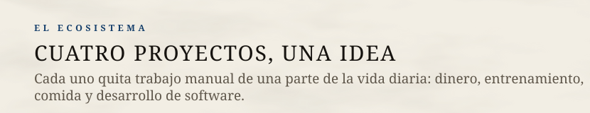

<a href="https://github.com/PabloRS98/finance-tracker">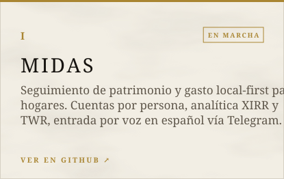</a>
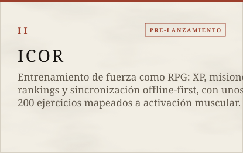
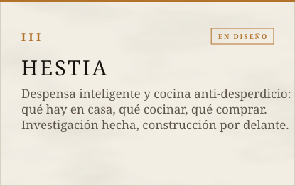
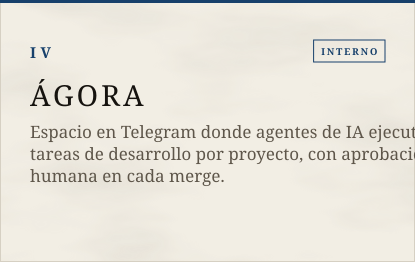

 

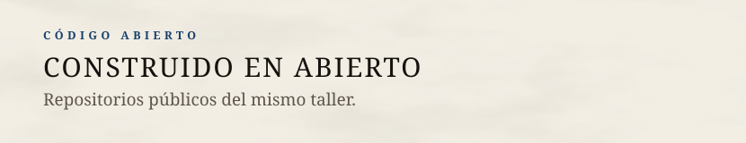
<a href="https://github.com/PabloRS98/projects-dashboard">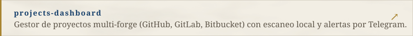</a>
<a href="https://github.com/PabloRS98/Content-Media-Manager">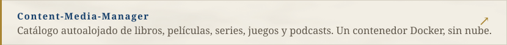</a>
<a href="https://github.com/PabloRS98/arquitectura-doble-agente">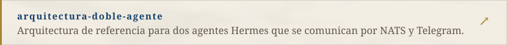</a>

> [!TIP]
> **Abierto a puestos junior, prácticas y proyectos en colaboración.**

